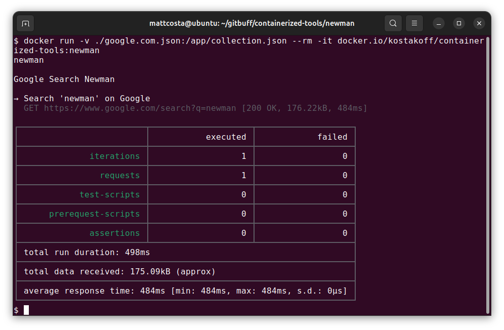

# rocky 8 nodejs-newman

## Run in docker

- run in docker
```
chmod 666 ./google.com.json
docker run -v ./google.com.json:/app/collection.json --rm -it docker.io/kostakoff/containerized-tools:newman
```

