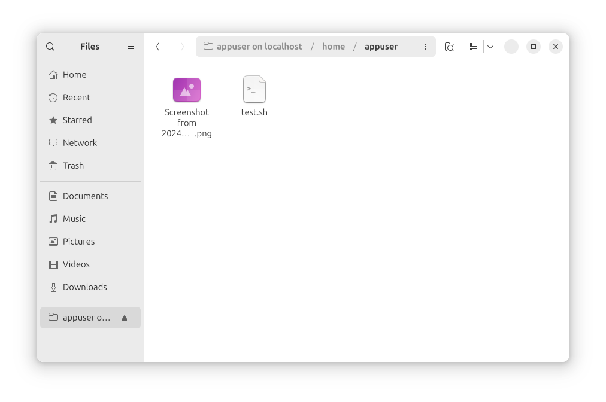

# rocky 8 ssh-server

## Run in docker compose

- deploy application container env in docker use compose
```bash
docker-compose up
```
- destroy application env
```bash
docker-compose down
```
- connect to ssh container from terminal
```bash
ssh -o StrictHostKeyChecking=no appuser@localhost -p 2222
```

## Connect from linux file explirer

Path: `sftp://appuser@localhost:2222`
